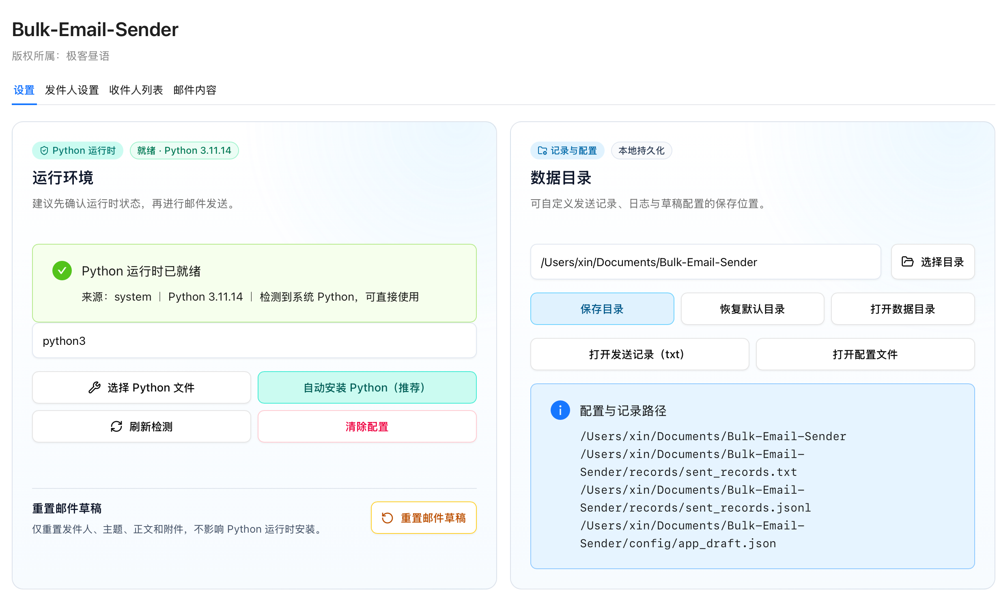

<div align="center">


# Bulk-Email-Sender

**批量 · 个性化 · 高效发邮件**

[](https://python.org)
[](LICENSE)
[](https://github.com/daytime001/bulk-email-sender/releases)

一款专为研究生导师申请场景设计的批量邮件发送工具。<br/>
支持**桌面客户端**与**命令行**两种使用方式，批量发送的同时保持每封邮件的个性化称呼。

</div>

---

## ✨ 核心功能

| 功能             | 说明                                             |
| ---------------- | ------------------------------------------------ |
| 🚀 **批量发送**   | 一次性向多位收件人发送邮件                       |
| 🎯 **个性化模板** | 每封邮件不同称呼                                 |
| 📎 **附件支持**   | 可随附简历、成绩单等多个文件                     |
| 📊 **断点续发**   | 自动记录已发送邮箱，重复运行时跳过，避免重复打扰 |
| ⏱️ **智能间隔**   | 随机发送间隔，降低触发邮件风控的概率             |
| 🖥️ **桌面客户端** | 提供图形界面，无需命令行即可使用                 |

> **注意**：本工具专注于批量发送，暂不含爬虫功能。导师邮箱数据需自行从学校官网整理，或使用「八爪鱼」等可视化工具采集。推荐[Python爬虫入门教程](https://mp.weixin.qq.com/s/1mp60tfnLcVMFH7w6S6rQg)

---

## 🚀 快速开始

### 方式 A — 桌面客户端（推荐）

前往 [Releases](https://github.com/daytime001/bulk-email-sender/releases) 下载对应平台安装包：

| 平台    | 安装包                                  |
| ------- | --------------------------------------- |
| macOS   | `bulk-email-sender_v*_darwin_*.dmg`     |
| Windows | `bulk-email-sender_v*_windows_*.msi`    |
| Linux   | `bulk-email-sender_v*_linux_*.AppImage` |

**使用流程：**
1. 填写 SMTP 配置，点击「连接测试」验证可用性
2. 导入导师数据文件（`.json` / `.xlsx`）
3. 编写邮件主题与正文模板（正文必须包含 `{teacher_name}` / `{sender_name}` / `{send_date}`）
4. 点击「开始发送」，实时查看进度与失败列表

**记录与配置文件（安装包场景）**
- 客户端会同时写入两类发送记录：
  - `sent_records.jsonl`（程序去重使用）
  - `sent_records.txt`（可读文本，便于非技术用户查看）
- 客户端提供：
  - 自定义「记录与配置保存目录」
  - 一键打开数据目录 / 可读记录（txt）/ 配置文件
- 默认目录：`文稿/Documents/Bulk-Email-Sender`（若系统不支持则回退到应用数据目录）
- 首次启动会自动写入示例收件人文件：
  - `recipients_sample.json`
  - `recipients_sample.xlsx`

#### 软件预览

<div align="center">
  
</div>


---

### 方式 B — Python 命令行

**1. 克隆仓库**

```bash
git clone https://github.com/daytime001/bulk-email-sender.git
cd bulk-email-sender
```

**2. 安装依赖（推荐使用 uv）**

```bash
uv sync --dev
```

**3. 配置发件信息**（编辑 `config.py`）

```python
SENDER_EMAIL    = "your_email@example.com"
SENDER_PASSWORD = "your_authorization_code"   # SMTP 授权码，非登录密码
SENDER_NAME     = "您的姓名"
SMTP_SERVER     = "smtp.163.com"
SMTP_PORT       = 465
```

**4. 准备收件人数据**（json/xlsx）

可直接从示例目录复制并改造：

- `examples/recipients/recipients_sample.json`
- `examples/recipients/recipients_sample.xlsx`

**5. 测试配置**

```bash
uv run python test_config.py
```

**6. 开始发送**

```bash
uv run python main.py
```

---

## 📖 配置参考

### SMTP 常见配置

| 邮箱服务商 | SMTP 服务器          | 端口      | 加密           |
| ---------- | -------------------- | --------- | -------------- |
| QQ 邮箱    | `smtp.qq.com`        | 465 / 587 | SSL / STARTTLS |
| 163 邮箱   | `smtp.163.com`       | 465 / 587 | SSL / STARTTLS |
| 126 邮箱   | `smtp.126.com`       | 465 / 587 | SSL / STARTTLS |
| Outlook    | `smtp.office365.com` | 587       | STARTTLS       |
| Gmail      | `smtp.gmail.com`     | 465 / 587 | SSL / STARTTLS |
| 教育邮箱   | 学校提供             | 学校提供  | 依学校配置     |

> `SENDER_PASSWORD` 填写的是 **SMTP 授权码**，不是邮箱登录密码。各邮箱的开启路径：「设置 → 安全 → POP3/SMTP/IMAP」。

### 收件人数据格式

支持 JSON 对象、JSON 数组和 XLSX 三种格式：

```json
{ "teacher1@university.edu.cn": "张教授", "teacher2@university.edu.cn": "李教授" }
```

```json
[
  { "email": "teacher1@university.edu.cn", "name": "张教授" },
  { "email": "teacher2@university.edu.cn", "name": "李教授" }
]
```

XLSX 推荐表头：`邮箱` + `姓名`（或英文 `email` + `name`）。

### 正文固定占位符

发送前会检查正文是否包含以下占位符，缺失任一都会阻止发送：

- `{teacher_name}`：收件人姓名
- `{sender_name}`：发件人姓名
- `{send_date}`：发送日期（如 `2026年2月26日`）

### 附件与发送节奏

```python
# config.py
ATTACHMENTS     = ["attachments/resume.pdf", "attachments/transcript.pdf"]
MIN_DELAY       = 5      # 最小发送间隔（秒）
MAX_DELAY       = 10     # 最大发送间隔（秒）
RANDOMIZE_ORDER = True   # 随机打乱发送顺序
```

发送记录会同时写入：
- `sent_records.jsonl`（结构化去重记录）
- `sent_records.txt`（可读文本记录）

重复运行会自动基于 `sent_records.jsonl` 跳过已发送地址。

---

## 🔧 常见问题

**认证失败** — 检查邮箱地址和授权码是否正确，确认 SMTP 服务已开启。

**被归入垃圾邮件** — 增大发送间隔、提升正文质量与个性化程度、控制单日发送量。

---

## ⚠️ 免责声明

本工具仅供学习与合法用途。使用时请遵守相关法律法规及邮件服务商条款，尊重收件人意愿，妥善保管授权码等敏感信息。

## 📄 许可证

[MIT](LICENSE)
