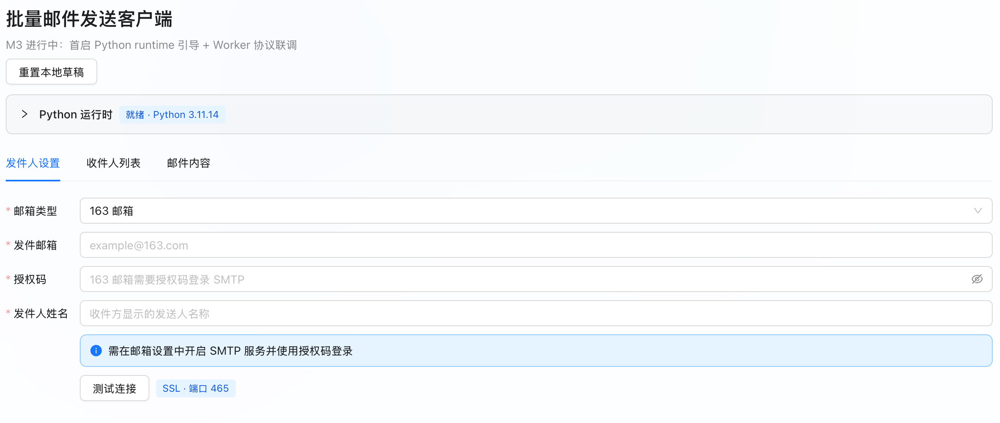

# 批量邮件发送工具

一个专为研究生导师申请场景设计的批量邮件发送工具，帮助你更高效地向多位导师发送自荐邮件。

本工具的关键点是“批量 + 个性化”：支持在邮件中自动替换导师姓名（例如 `{teacher_name}`），避免使用千篇一律的通用称呼。

## ⚠️ 重要说明（导师数据需自行获取）

**本工具专注于批量发送邮件，暂不包含爬虫功能。导师邮箱信息需要用户自行从学校/学院官网等渠道整理。**

为什么不内置爬虫：
- 不同学校官网结构差异很大，通用爬虫很难可靠覆盖
- 你可以按目标学校页面结构自行编写爬虫脚本，或使用八爪鱼等可视化工具.推荐[Python爬虫入门教程](https://mp.weixin.qq.com/s/1mp60tfnLcVMFH7w6S6rQg)

## ✨ 主要功能

- 🚀 **批量发送**：一次性向多位导师发送邮件
- 🎯 **个性化称呼**：支持 `{teacher_name}` 自动替换为导师姓名
- 📎 **附件支持**：支持附带简历、成绩单等文件
- 📝 **模板定制**：自定义邮件主题与正文模板
- 📊 **发送记录**：记录已发送邮箱，重复运行时自动跳过（避免重复打扰）
- ⏱️ **发送节奏**：随机发送间隔，降低触发风控的概率

## 📋 系统要求

- Python 3.9+
- 任意支持 SMTP 的邮箱账号（需开启授权码或应用专用密码）

## 🚀 快速开始（两种使用方式）

### 方式 A：桌面客户端（推荐）

在 [Releases](https://github.com/daytime001/bulk-email-sender/releases) 下载并安装对应系统安装包：

| 平台    | 安装包（示例）                          |
| ------- | --------------------------------------- |
| Windows | `bulk-email-sender_v*_windows_*.msi`    |
| macOS   | `bulk-email-sender_v*_darwin_*.dmg`     |
| Linux   | `bulk-email-sender_v*_linux_*.AppImage` |

桌面客户端使用流程：
1. 填写 SMTP 配置并先做“连接测试”
2. 导入导师数据文件（`.json` / `.xlsx`）
3. 填写主题与正文模板（包含 `{teacher_name}`）
4. 开始发送并查看进度与失败列表



### 方式 B：直接运行 Python 脚本

1. 下载代码

```bash
git clone https://github.com/daytime001/bulk-email-sender.git
cd bulk-email-sender
```

2. 配置邮箱信息（编辑 `config.py`）

```python
SENDER_EMAIL = "your_email@example.com"
SENDER_PASSWORD = "your_authorization_code"  # SMTP 授权码/应用专用密码
SENDER_NAME = "您的姓名"

SMTP_SERVER = "smtp.163.com"
SMTP_PORT = 465
```

3. 准备导师数据（编辑 `data/teachers.json` 或使用 `.xlsx`）

4. （可选）添加附件（放入 `attachments/` 并在 `config.py` 配置）

5. 测试配置

```bash
python test_config.py
```

6. 开始发送

```bash
python main.py
```

## 📖 详细配置说明

### 1) 邮箱与 SMTP 配置

#### 获取 SMTP 授权码（通用）

1. 登录邮箱网页版
2. 进入“设置 / 安全 / POP3/SMTP/IMAP”等页面
3. 开启 SMTP 服务
4. 生成授权码或应用专用密码（填入 `SENDER_PASSWORD`）

⚠️ **重要**：`SENDER_PASSWORD` 通常是授权码，不是邮箱登录密码。

#### 常见邮箱 SMTP 参考

| 邮箱服务商        | SMTP Host            |      端口 | 加密方式       |
| ----------------- | -------------------- | --------: | -------------- |
| QQ 邮箱           | `smtp.qq.com`        | `465/587` | SSL / STARTTLS |
| 163 邮箱          | `smtp.163.com`       | `465/587` | SSL / STARTTLS |
| 126 邮箱          | `smtp.126.com`       | `465/587` | SSL / STARTTLS |
| Outlook / Hotmail | `smtp.office365.com` |     `587` | STARTTLS       |
| Gmail             | `smtp.gmail.com`     | `465/587` | SSL / STARTTLS |
| 教育邮箱          | 学校提供             |  学校提供 | 依学校配置     |

> 不同学校/企业邮箱策略差异较大，若失败请以邮箱官方文档为准。

### 2) 邮件主题与正文模板

- 主题：`EMAIL_SUBJECT`
- 正文：`EMAIL_CONTENT`
- 模板变量：
  - `{teacher_name}`：导师姓名（核心变量，用于个性化称呼）

示例（节选）：

```text
尊敬的{teacher_name}：

您好！我是……（此处填写自我介绍）
```

### 3) 导师数据格式（需自行整理/爬取）

你需要自行从官网整理导师邮箱数据，然后写入 `data/teachers.json` 或准备 `.xlsx` 文件。

#### JSON（对象）

```json
{
  "teacher1@university.edu.cn": "张教授",
  "teacher2@university.edu.cn": "李教授"
}
```

#### JSON（数组）

```json
[
  { "email": "teacher1@university.edu.cn", "name": "张教授" },
  { "email": "teacher2@university.edu.cn", "name": "李教授" }
]
```

#### XLSX

- 推荐表头：`邮箱/邮箱地址/email` 与 `姓名/name`
- 或者：A 列为邮箱，B 列为姓名

### 4) 附件配置

把附件放到 `attachments/`，并在 `config.py` 中配置：

```python
ATTACHMENTS = [
  "attachments/resume.pdf",
  "attachments/transcript.pdf",
]
```

### 5) 发送控制与去重

`config.py` 常用项：

```python
MIN_DELAY = 30
MAX_DELAY = 60
RANDOMIZE_ORDER = True
ADD_TEACHER_SUFFIX = True
```

发送记录会写入 `sent_records.jsonl`，重复运行时会自动跳过已发送邮箱。

## 🔧 故障排除（常见问题）

1. **认证失败**
   - 检查邮箱地址与授权码是否正确
   - 确认已开启 SMTP / IMAP / POP3 等相关开关（各邮箱不同）
2. **连接失败**
   - 检查 `SMTP_SERVER`、`SMTP_PORT` 是否正确
   - 尝试切换端口（465/587）与加密方式
3. **被识别为垃圾邮件**
   - 增加发送间隔
   - 优化正文质量与个性化程度
   - 控制单日发送量

## ⚠️ 免责声明

本工具仅供学习与合法用途使用。使用者应当：
1. 遵守相关法律法规与邮件服务商条款
2. 尊重收件人意愿，避免骚扰与滥发
3. 妥善保管授权码等敏感信息

## 📄 许可证

MIT（见 `LICENSE`）
